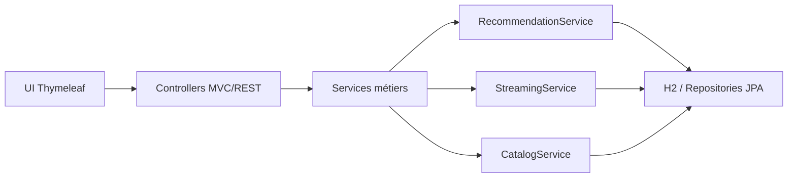

## Introduction : pourquoi une application “à toute épreuve” ?

### Le nouveau contexte de la production moderne

Microservices, API tierces, bases partagées, réseaux capricieux, cloud qui scale… **les pannes ne sont plus l’exception**.  
L’objectif n’est plus d’“éviter” l’incident, mais de **maintenir un service acceptable** même quand tout ne va pas bien.

Un service qui répond lentement peut **asphyxier** toute la chaîne.  
Un composant en panne peut déclencher un **effet de cascade**.  
Un pic de trafic peut rendre l’application **indisponible** alors qu’aucune erreur “fonctionnelle” ne s’est produite.

### De l’application fragile à la forteresse de résilience

L’image de la forteresse résume bien l’idée : on ne se contente pas de mettre des `try/catch`.  
On **conçoit la résilience**, on **l’éprouve**, puis on **la mesure**.

Dans cet article, on construit cette forteresse en trois couches :

- **Resilience4j** pour la résilience par design (remparts)
- **Chaos Monkey** pour l’expérimentation (béliers contrôlés)
- **Gatling** pour valider sous charge (siège à grande échelle)

### L’application d’exemple et le code support

Le fil rouge est une application Spring Boot de streaming vidéo (type Disney+/Netflix), basée sur le repo `chaos-monkey-application`.  
On y retrouve un contrôleur MVC, des services métiers, des dépendances externes simulées, une base H2 et des endpoints REST.  
Le front est en [[Intégration de Thymeleaf dans une application Spring Boot|Thymeleaf]], ce qui permet d’illustrer aussi la partie “expérience utilisateur dégradée”.

Quelques briques clés du repo :  
`CatalogService`, `StreamingService`, `RecommendationService`, `UserService`, des repositories JPA, une UI v1/v2, et des endpoints REST (`/api/catalog`, `/api/streaming`, `/api/recommendations`).  
L’objectif est de **partir de cette base** et de la renforcer couche par couche.

### Le trajet d’une requête (et où ça peut casser)

Prenons un parcours “classique” d’utilisateur :

1. Il ouvre le catalogue (`GET /api/catalog/videos`)
2. Il lance un stream (`POST /api/streaming/start`)
3. Il récupère des recommandations (`GET /api/recommendations/{userId}`)

Sur ce trajet, les points de casse sont multiples : base de données, latence réseau, surcharge CPU, services tiers simulés.  
L’idée est simple : **chaque point de casse mérite un mécanisme de résilience**.

> [!note] Capture d’écran ici  
> Schéma simple du flux (Catalogue → Streaming → Recommandations).

### Architecture logique (vue simplifiée)



> [!note] Capture d’écran ici  
> Schéma architecture (version “forteresse” avec Resilience4j autour des services).

L’article complète trois ressources existantes :

- [[Introduisez du chaos dans votre application Spring Boot]]
- [[Maîtrisez les Tests de Charge avec Gatling pour Spring Boot]]
- [[Résilience applicative avec Resilience4j et Spring Boot]]

L’objectif ici est de **les relier dans un même parcours opérationnel**.

---

## Poser les fondations : concevoir la résilience avec Resilience4j

### Identifier les points de fragilité de l’application

Dans l’application, plusieurs points sont critiques :

- démarrage du streaming (`StreamingService.startStream`),
- génération de recommandations (`RecommendationService.generateRecommendations`),
- récupération de données (catalogue, historique, utilisateurs).

Ce sont des appels qui peuvent **échouer**, **ralentir** ou **saturer**.  
On commence donc par les cartographier, puis on place des mécanismes de protection.

Exemples concrets de fragilité dans le repo :

- démarrage de stream avec latence simulée (`Thread.sleep(100)`),\n- recommandations dépendantes de la base,\n- endpoints de streaming sensibles à la charge (lecture de ressources MP4).

Ce sont des “zones à risque” idéales pour introduire de la résilience.

Pour rendre cela explicite, on peut cartographier risques et contre‑mesures :

| Zone fragile                   | Risque                    | Protection                                  |
| ------------------------------ | ------------------------- | ------------------------------------------- |
| `StreamingService.startStream` | Latence / indisponibilité | Timeout + Retry + CircuitBreaker + Fallback |
| `RecommendationService`        | Erreurs DB / surcharge    | CircuitBreaker + Fallback                   |
| Endpoints streaming            | Saturation threads        | Bulkhead + RateLimiter                      |

> [!note] Capture d’écran ici  
> Tableau “Risques / Protections” ou version schématisée.

### Timeouts et isolation : ne pas subir la lenteur

Un service qui met 30 secondes à répondre ne doit jamais bloquer une requête utilisateur aussi longtemps.  
La première brique de résilience, ce sont les **timeouts**.

Dans ce repo, on illustre le timeout via une exécution encapsulée :  
on limite le temps d’un appel avec un `Future.get(timeout)`, et on transforme l’expiration en exception métier.

```java
private <T> T executeWithTimeout(String taskName, Supplier<T> supplier) {
    ExecutorService executor = Executors.newSingleThreadExecutor();
    try {
        log.info("[{}] ⏳ Début attente (Timeout réglé à 2s)...", taskName);
        Future<T> future = executor.submit(() -> {
            long start = System.currentTimeMillis();
            log.info("[{}] 🟢 Thread Worker démarré", taskName);
            T result = supplier.get();
            log.info("[{}] ✅ Service terminé proprement en {} ms", taskName,
                    (System.currentTimeMillis() - start));
            return result;
        });

        return future.get(2, TimeUnit.SECONDS);
    } catch (TimeoutException e) {
        log.error("[{}] 💥 TIMEOUT déclenché ! Fermeture forcée du thread.", taskName);
        throw new RequestTimeoutException("Le service a mis trop de temps.");
    } catch (InterruptedException | ExecutionException e) {
        log.error("[{}] ❌ Erreur : {}", taskName, e.getMessage());
        throw new RuntimeException("Erreur lors de l'exécution", e);
    } finally {
        executor.shutdownNow();
    }
}
```

Ce n’est pas la seule approche possible, mais elle **rend le timeout visible** et testable.  
Sans timeout, la latence se propage.  
Avec un timeout, on **borne** la dégradation : la requête échoue vite, et on peut basculer sur un fallback.

> [!note] Pourquoi ce choix est volontairement simple  
> Cette approche est parfaite pour **illustrer la mécanique du timeout** et la réaction du système.  
> Dans une vraie app, on préférera **propager le timeout au niveau des clients HTTP** (WebClient, RestClient),  
> afin d’éviter de multiplier des threads dédiés.  
> Ici, l’objectif pédagogique est clair : **voir le timeout, déclencher le fallback, mesurer l’impact**.

> [!note] Capture d’écran ici  
> Log montrant un timeout déclenché (`TIMEOUT` + fallback).

### Circuit Breaker : casser l’effet “marteau‑piqueur”

Le circuit breaker évite d’acharner un service déjà en panne.  
Dans `RecommendationService`, il protège l’appel qui récupère les recommandations :

```java
@CircuitBreaker(name = "recommendationService", fallbackMethod = "fallbackRecommendations")
public List<Recommendation> getRecommendationsForUser(Long userId) {
    log.info("Fetching recommendations for user: {}", userId);
    return recommendationRepository.findTop10ByUserIdOrderByScoreDesc(userId);
}
```

En cas de panne, le fallback renvoie un contenu dégradé mais utile :

```java
public List<Recommendation> fallbackRecommendations(Long userId, Throwable t) {
    log.warn("Circuit breaker open or error fetching recommendations for user {}. Reason: {}", userId, t.getMessage());
    List<Video> popular = videoRepository.findTop10ByOrderByViewCountDesc();
    return popular.stream()
            .map(v -> new Recommendation(userId, v.getId(), 0.0, "Popular now (Fallback)"))
            .collect(Collectors.toList());
}
```

La configuration associée est déclarée dans `application.properties` :

```properties
resilience4j.circuitbreaker.instances.recommendationService.registerHealthIndicator=true
resilience4j.circuitbreaker.instances.recommendationService.slidingWindowSize=10
resilience4j.circuitbreaker.instances.recommendationService.failureRateThreshold=50
resilience4j.circuitbreaker.instances.recommendationService.waitDurationInOpenState=10s
```

Ce sont ces paramètres qui dictent **quand** le disjoncteur s’ouvre et **combien de temps** il reste ouvert.

### Retry et backoff : encaisser les pannes transitoires

Les pannes transitoires (réseau, surcharge temporaire) peuvent souvent être absorbées par un retry contrôlé.  
Dans `StreamingService`, un retry est appliqué sur le démarrage du stream :

```java
@Retry(name = "streamingService", fallbackMethod = "fallbackStartStream")
@CircuitBreaker(name = "streamingService")
public Map<String, Object> startStream(Long userId, Long videoId) {
    // ...
}
```

La configuration du retry est centralisée dans `application.properties` :

```properties
resilience4j.retry.instances.recommendationService.maxAttempts=3
resilience4j.retry.instances.recommendationService.waitDuration=500ms

resilience4j.retry.instances.streamingService.maxAttempts=3
resilience4j.retry.instances.streamingService.waitDuration=1s
```

On reste volontairement **raisonnable** sur le nombre de tentatives pour ne pas saturer un service déjà fragile.

> [!note] Capture d’écran ici  
> Log “retry attempt” visible dans la console au moment d’une panne simulée.

### Bulkhead et Rate Limiter : protéger les ressources internes

Même si un service externe tombe, il ne doit pas consommer **tous les threads** de l’application.  
C’est exactement le rôle des **bulkheads** (sémaphores ou pools dédiés) et des **rate limiters**.

Dans ce repo, ils ne sont pas encore activés, mais l’architecture est prête.  
On pourrait isoler les appels vers des dépendances externes en dédiant un pool par service.

L’idée est simple : même si `RecommendationService` s’effondre, `StreamingService` doit continuer à fonctionner.  
La résilience ne sert à rien si un seul composant peut “tout faire tomber”.

### Fallbacks : offrir une expérience dégradée mais contrôlée

La résilience n’est pas seulement “ne pas planter”.  
C’est **rendre un service acceptable** même dégradé.

Dans `StreamingService`, le fallback fournit un statut explicite :

```java
public Map<String, Object> fallbackStartStream(Long userId, Long videoId, Throwable t) {
    Map<String, Object> streamInfo = new HashMap<>();
    streamInfo.put("status", "TEMPORARILY_UNAVAILABLE");
    streamInfo.put("error", t.getMessage());
    return streamInfo;
}
```

Pour l’utilisateur, la différence est majeure :  
on ne renvoie pas une 500 opaque, on renvoie une réponse **compréhensible** et **gérable** côté UI.

Dans l’application, les pages d’erreur sont thématiques, ce qui renforce cette logique de “dégradation contrôlée”.

---

## Mettre la forteresse à l’épreuve : Chaos Monkey en environnement contrôlé

### Pourquoi le chaos est indispensable à la résilience

Sans expérimentation, la résilience reste théorique.  
Le chaos engineering permet de **valider en conditions contrôlées** que les mécanismes de protection fonctionnent vraiment.

### Brancher Chaos Monkey sur l’application Spring Boot

Le repo intègre `chaos-monkey-spring-boot` directement dans le module `chaos-application` :

```xml
<dependency>
    <groupId>de.codecentric</groupId>
    <artifactId>chaos-monkey-spring-boot</artifactId>
    <version>4.0.0</version>
</dependency>
```

Un profil dédié active l’exposition des endpoints dans `application-chaos-monkey.yaml` :

```yaml
management:
  endpoint:
    chaosmonkey:
      enabled: true
  endpoints:
    web:
      exposure:
        include: chaosmonkey, health, info, circuitbreakers, retries
```

On lance l’application avec ce profil (voir [[Les profils dans Spring Boot]]) :

```bash
mvn -pl chaos-application -am spring-boot:run -Dspring-boot.run.profiles=chaos-monkey
```

Ensuite, on contrôle Chaos Monkey via [[Découverte des Actuators dans Spring Boot|Actuator]] :

```bash
curl http://localhost:8080/actuator/chaosmonkey
curl -X POST http://localhost:8080/actuator/chaosmonkey/enable
curl -X POST http://localhost:8080/actuator/chaosmonkey/disable
```

> [!note] Capture d’écran ici  
> Swagger/Actuator avec les endpoints `chaosmonkey`, `circuitbreakers`, `retries`.

### Simuler la latence : tester les timeouts et les retries

Scénario : injection de latence sur `StreamingService`.  
On observe alors :

- des timeouts côté client,
- des retries Resilience4j,
- et, si la panne persiste, le fallback.

Exemple simple pour déclencher un stream :

```bash
curl -X POST http://localhost:8080/api/streaming/start \\
  -H \"Content-Type: application/json\" \\
  -d '{\"userId\": 1, \"videoId\": 1}'
```

> [!note] Capture d’écran ici  
> UI v2 (Thymeleaf) avec un fallback visible “TEMPORARILY_UNAVAILABLE”.

### Provoquer des erreurs : valider le circuit breaker

Scénario : injection d’exceptions sur les recommandations.  
Le circuit breaker s’ouvre, et l’on bascule vers le fallback “contenu populaire”.

Exemple côté recommandations :

```bash
curl http://localhost:8080/api/recommendations/1
```

Quand le breaker s’ouvre, la réponse reste valide, mais le contenu devient “Popular now (Fallback)”.

> [!note] Capture d’écran ici  
> Logs montrant l’ouverture du circuit breaker + le fallback exécuté.

### Documenter les scénarios de chaos dans le code

Les scénarios doivent être **reproductibles**.  
L’idée est de documenter clairement :

- les endpoints Actuator utilisés,
- les types de pannes injectées,
- la réaction attendue (fallback, breaker, logs).

Une bonne pratique consiste à conserver un petit **runbook** dans le repo (ou dans le README) avec les commandes à rejouer.

Exemple de runbook minimal :

```bash
# Activer le chaos
curl -X POST http://localhost:8080/actuator/chaosmonkey/enable

# Vérifier l’état des breakers
curl http://localhost:8080/actuator/circuitbreakers

# Tester un stream
curl -X POST http://localhost:8080/api/streaming/start \\
  -H \"Content-Type: application/json\" \\
  -d '{\"userId\": 1, \"videoId\": 1}'
```

> [!note] Capture d’écran ici  
> Extrait du runbook dans le README ou un fichier dédié.

---

## Tester la forteresse sous pression : charge et performance avec Gatling

### Pourquoi la résilience doit résister à la montée en charge

Certaines faiblesses n’apparaissent qu’avec la charge : saturation de pools, ouverture du circuit breaker, montée des erreurs.  
Le test de charge valide que les remparts tiennent **quand la pression augmente**.

### Scénario de charge : reproduire un trafic réaliste

Le scénario Gatling (`ChaosSimulation`) simule des parcours d’utilisateurs réalistes :

- navigation catalogue,
- démarrage d’un streaming,
- visionnage partiel,
- mise à jour de progression.

Il alterne plusieurs profils (`browser`, `watcher`, `social_watcher`) pour éviter un trafic artificiel.

Extrait d’assertions définies dans la simulation :

```java
assertions(
    global().successfulRequests().percent().gt(95.0),
    global().responseTime().percentile3().lt(1500),
    details("Watcher Journey", "Stream Video Chunk").failedRequests().percent().lt(5.0)
)
```

Gatling génère automatiquement un rapport HTML par exécution.  
On peut donc comparer **avec et sans chaos** très visuellement.

Les rapports se trouvent dans :  
`gatling-test/target/gatling/`  
chaque exécution crée un dossier daté avec un `index.html`.

> [!note] Capture d’écran ici  
> Rapport Gatling sans chaos (latence stable, faible taux d’erreurs).

> [!note] Capture d’écran ici  
> Rapport Gatling avec chaos (latence dégradée, mais disponibilité préservée).

```java
setUp(
    userJourneyScenario.injectOpen(
        incrementUsersPerSec(5)
            .times(5)
            .eachLevelLasting(Duration.ofSeconds(30))
            .separatedByRampsLasting(Duration.ofSeconds(10))
            .startingFrom(10)
    )
).protocols(HTTP_PROTOCOL)
```

### Tir sans chaos : établir la ligne de base

On exécute d’abord le scénario sans Chaos Monkey pour obtenir une **baseline** : latence, taux d’erreur, throughput.

Sans baseline, impossible de mesurer l’impact réel des pannes injectées.

> [!note] Capture d’écran ici  
> Tableau comparatif “Sans chaos / Avec chaos”.

### Tir avec chaos activé : observer la résilience en action

On relance ensuite avec Chaos Monkey actif :

- les retries absorbent certaines erreurs,
- les breakers s’ouvrent lorsqu’un seuil est atteint,
- les fallbacks évitent une panne totale.

Le système se dégrade, mais reste **utilisable**.

> [!note] Capture d’écran ici  
> Courbes de latence comparées (baseline vs chaos).

Cette comparaison est essentielle :  
elle montre la différence entre “application fragile” et “forteresse de résilience”.

### Interpréter les résultats : SLO et décisions concrètes

Les résultats doivent être reliés à des objectifs concrets :

- taux de succès global,
- percentile 95/99 de latence,
- taux de réponses “dégradées”.

Si un objectif ne tient pas, on ne “jette pas” la résilience :  
on ajuste les paramètres et on rejoue le scénario.

Exemples de décisions concrètes :

- augmenter la fenêtre du circuit breaker si trop sensible,
- réduire le nombre de retries si le service en face est trop fragile,
- limiter davantage la charge sur un endpoint à fort coût CPU.

---

## Voir pour croire : observabilité et signaux de résilience

### Instrumenter les patterns de résilience

Les métriques Resilience4j sont exposées via [[Découverte des Actuators dans Spring Boot|Actuator]] :

- `GET /actuator/circuitbreakers`
- `GET /actuator/retries`

Ces métriques permettent de savoir **quand** un breaker s’ouvre, **combien** de retries sont déclenchés, et **à quelle fréquence**.

Dans le profil `chaos-monkey`, la santé des breakers est aussi exposée via `health` :

```yaml
management:
  health:
    circuitbreakers:
      enabled: true
```

Cela donne une lecture simple : breaker ouvert = état dégradé.

### Dashboards et alertes : surveiller la forteresse en continu

Même sans stack Prometheus/Grafana, un tableau minimal (latence + état des breakers) donne une vraie lecture.  
Cela permet d’identifier les dérives avant que la prod ne souffre.

Avec une stack métriques, on peut afficher :

- ratio d’erreurs vs trafic,
- latence moyenne vs percentile 95/99,
- état des breakers (closed/open/half-open).

> [!note] Capture d’écran ici  
> Écran Actuator `circuitbreakers` ou dashboard métriques minimal.

---

## Guide pas à pas : transformer votre application en forteresse

### Étape 1 : cloner et lancer l’application “naïve”

```bash
git clone <repo>
cd chaos-monkey-application
mvn -pl chaos-application -am spring-boot:run
```

Objectif : vérifier que l’application tourne et que les endpoints répondent.

### Étape 2 : activer et configurer Resilience4j

- ajouter les annotations `@CircuitBreaker` et `@Retry`,
- configurer les seuils dans `application.properties`,
- vérifier les fallbacks.

Objectif : observer les premiers mécanismes de protection (même sans chaos).

### Étape 3 : introduire le chaos et observer

```bash
mvn -pl chaos-application -am spring-boot:run -Dspring-boot.run.profiles=chaos-monkey
```

Puis activer/désactiver le chaos via Actuator :

```bash
curl -X POST http://localhost:8080/actuator/chaosmonkey/enable
curl -X POST http://localhost:8080/actuator/chaosmonkey/disable
```

Objectif : déclencher des pannes contrôlées et vérifier les réactions (fallback, breakers, logs).

### Étape 4 : lancer les tests de charge

```bash
mvn -pl gatling-test -am test
```

Comparer les rapports Gatling **avec et sans chaos**.

Objectif : valider que la résilience tient **sous pression**.

### Étape 5 : aller plus loin

- intégrer ces tests dans la CI/CD,
- rejouer des scénarios de chaos en pré‑prod,
- étendre la résilience à d’autres services,
- ajouter des alertes sur les métriques Resilience4j.

Objectif : passer d’une expérimentation ponctuelle à une **culture de résilience**.

---

## Conclusion

Une application “à toute épreuve” ne se résume pas à quelques annotations.  
Elle se **conçoit**, se **teste**, se **mesure**.

Avec Resilience4j, Chaos Monkey et Gatling, on passe d’une application fragile à une forteresse de résilience, capable d’encaisser et de continuer à servir un système acceptable, même sous pression.
